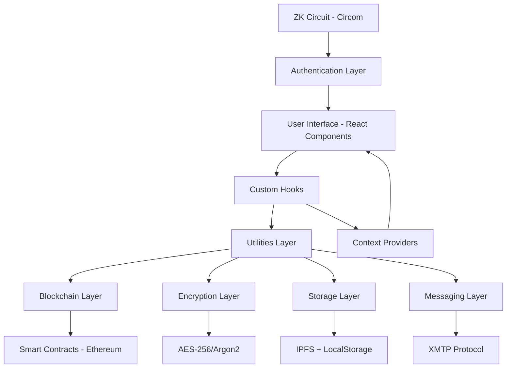
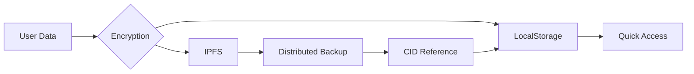

# PassNexus - Complete Technical Documentation

> **Comprehensive Documentation of All Technologies, Tools, Libraries, and Components**
>
> **Last Updated:** December 11, 2025
>
> **Version:** 1.0.0

---

## 📋 Table of Contents

1. [Project Overview](#project-overview)
2. [Technology Stack](#technology-stack)
3. [Architecture Overview](#architecture-overview)
4. [Dependencies & Libraries](#dependencies--libraries)
5. [Smart Contracts](#smart-contracts)
6. [Zero-Knowledge Proofs](#zero-knowledge-proofs)
7. [Core Utilities](#core-utilities)
8. [Custom Hooks](#custom-hooks)
9. [React Components](#react-components)
10. [Configuration Files](#configuration-files)
11. [Development Workflow](#development-workflow)
12. [Security Features](#security-features)
13. [Data Flow & Storage](#data-flow--storage)
14. [API Integrations](#api-integrations)

---

## 🎯 Project Overview

**PassNexus** is a decentralized, blockchain-based password management application that combines cutting-edge Web3 technologies to provide secure, privacy-preserving credential storage and sharing.

### Core Features

- 🔐 **Decentralized Password Vault** - End-to-end encrypted password storage
- 💳 **Credit Card Management** - Secure card information storage
- ✨ **Password Generator** - Cryptographically secure password generation
- 🤝 **Friend System** - Blockchain-based friend connections
- 📤 **Secure Sharing** - XMTP-based encrypted password sharing
- 🔔 **Real-time Notifications** - Activity tracking and alerts
- 🛡️ **Zero-Knowledge Authentication** - ZK-SNARK based login system
- 🌐 **IPFS Storage** - Distributed file storage for encrypted data
- ⚡ **Multi-Wallet Support** - MetaMask, Google, Email, Rabby wallet support

---

## 🛠️ Technology Stack

### Frontend Framework
- **React** v19.2.0 - Modern React with latest features
- **TypeScript** v5.9.3 - Type-safe development
- **Vite** v7.2.4 - Lightning-fast build tooling

### UI/UX
- **Framer Motion** v12.23.24 - Advanced animations and transitions
- **TailwindCSS** v3.4.17 - Utility-first CSS framework
- **React Hot Toast** v2.6.0 - Elegant notification system
- **React Blockies** v1.4.1 - Ethereum-style identicons
- **React QR Code** v2.0.18 - QR code generation for addresses

### Blockchain & Web3
- **Ethers.js** v6.15.0 - Ethereum library and utilities
- **Thirdweb** v5.114.1 - Web3 development framework
  - Social login (Google, Email)
  - Multi-wallet connection support
  - Account abstraction
- **Hardhat** v2.27.1 - Ethereum development environment
- **Solidity** v0.8.28 - Smart contract language

### Cryptography & Security
- **CryptoJS** v4.2.0 - AES-256 encryption implementation
- **Hash-WASM** v4.12.0 - High-performance hashing (Argon2)
- **SnarkJS** v0.7.5 - Zero-knowledge proof generation & verification
- **Circomlibjs** v0.1.7 - Circom circuit library (Poseidon hash)

### Decentralized Storage & Messaging
- **IPFS HTTP Client** v60.0.1 - InterPlanetary File System client
- **XMTP.js** v13.0.4 - Encrypted messaging protocol

### Routing & Navigation
- **React Router DOM** v7.9.6 - Client-side routing

### Development Tools
- **ESLint** v9.39.1 - Code linting
- **TypeScript ESLint** v8.46.4 - TypeScript-specific linting
- **PostCSS** v8.5.6 - CSS processing
- **Autoprefixer** v10.4.22 - CSS vendor prefixing
- **Vite Plugin Node Polyfills** v0.24.0 - Node.js polyfills for browser

---

## 🏗️ Architecture Overview

### Application Architecture



### Data Flow

1. **User Authentication**
   - Wallet connection via Thirdweb
   - ZK-proof generation for password verification
   - Master key derivation from wallet signature

2. **Password Storage**
   - User creates password entry
   - Data encrypted with AES-256 or Argon2
   - Encrypted data uploaded to IPFS
   - IPFS CID + encrypted data stored locally
   - Metadata saved to localStorage

3. **Password Retrieval**
   - User authenticates via ZK-proof
   - Master key derived from wallet signature
   - Encrypted data decrypted locally
   - Password displayed to user

4. **Password Sharing**
   - Password encrypted with recipient's key
   - Shared via XMTP encrypted messaging
   - Recipient decrypts with their wallet

---

## 📦 Dependencies & Libraries

### Production Dependencies

| Package | Version | Purpose |
|---------|---------|---------|
| `@xmtp/xmtp-js` | ^13.0.4 | Encrypted peer-to-peer messaging |
| `circomlibjs` | ^0.1.7 | Circom circuit utilities (Poseidon) |
| `crypto-js` | ^4.2.0 | Cryptographic operations (AES) |
| `ethers` | ^6.15.0 | Ethereum blockchain interactions |
| `framer-motion` | ^12.23.24 | UI animations and transitions |
| `hash-wasm` | ^4.12.0 | High-performance Argon2 hashing |
| `ipfs-http-client` | ^60.0.1 | IPFS storage client |
| `react` | ^19.2.0 | UI library |
| `react-blockies` | ^1.4.1 | Ethereum address identicons |
| `react-dom` | ^19.2.0 | React DOM rendering |
| `react-hot-toast` | ^2.6.0 | Toast notifications |
| `react-qr-code` | ^2.0.18 | QR code generation |
| `react-router-dom` | ^7.9.6 | Client-side routing |
| `snarkjs` | ^0.7.5 | ZK-SNARK operations |
| `thirdweb` | ^5.114.1 | Web3 authentication & wallets |

### Development Dependencies

| Package | Version | Purpose |
|---------|---------|---------|
| `@eslint/js` | ^9.39.1 | JavaScript linting rules |
| `@nomicfoundation/hardhat-toolbox` | ^5.0.0 | Hardhat development toolkit |
| `@types/crypto-js` | ^4.2.2 | TypeScript types for CryptoJS |
| `@types/node` | ^24.10.1 | Node.js TypeScript types |
| `@types/react` | ^19.2.5 | React TypeScript types |
| `@types/react-dom` | ^19.2.3 | React DOM TypeScript types |
| `@vitejs/plugin-react` | ^5.1.1 | Vite React plugin |
| `autoprefixer` | ^10.4.22 | CSS autoprefixing |
| `buffer` | ^6.0.3 | Buffer polyfill for browser |
| `eslint` | ^9.39.1 | Code linting |
| `eslint-plugin-react-hooks` | ^7.0.1 | React Hooks linting |
| `eslint-plugin-react-refresh` | ^0.4.24 | React Refresh linting |
| `globals` | ^16.5.0 | Global variables definitions |
| `hardhat` | ^2.27.1 | Ethereum development environment |
| `postcss` | ^8.5.6 | CSS transformation |
| `tailwindcss` | ^3.4.17 | Utility-first CSS framework |
| `typescript` | ~5.9.3 | TypeScript compiler |
| `typescript-eslint` | ^8.46.4 | TypeScript ESLint integration |
| `vite` | ^7.2.4 | Build tool and dev server |
| `vite-plugin-node-polyfills` | ^0.24.0 | Node.js polyfills for Vite |

---

## 📜 Smart Contracts

### PassNexusRegistry.sol

**Location:** `contracts/PassNexusRegistry.sol`

**Solidity Version:** 0.8.28

**Purpose:** Manages user registration, friend connections, and email-to-address mapping on Ethereum blockchain.

#### Contract Features

1. **User Registration**
   - Register wallet address with public encryption key
   - One-time registration per address
   - Emits `UserRegistered` event

2. **Friend Management**
   - Add friends by wallet address
   - Query friend list
   - Check friendship status
   - Emits `FriendAdded` event

3. **Email Registry**
   - Link email addresses to wallet addresses
   - Bidirectional lookup (email ↔ address)
   - Prevents duplicate registrations
   - Emits `EmailRegistered` event

#### Key Functions

```solidity
// User registration
function registerUser(string memory publicKey) public

// Friend management
function addFriend(address friendAddress) public
function getFriends() public view returns (address[] memory)
function isFriend(address user, address friend) public view returns (bool)
function getFriendCount(address userAddress) public view returns (uint)

// Email registry
function registerEmail(string memory _email) public
function getAddressByEmail(string memory _email) public view returns (address)
function getEmailByAddress(address _addr) public view returns (string memory)
function isEmailRegistered(string memory _email) public view returns (bool)

// Utility functions
function getPublicKey(address userAddress) public view returns (string memory)
function isUserRegistered(address userAddress) public view returns (bool)
```

#### Events

```solidity
event UserRegistered(address indexed user, string publicKey);
event FriendAdded(address indexed user, address indexed friend);
event EmailRegistered(address indexed user, string email);
```

#### Deployment

- **Network:** Local Hardhat network (chainId: 31337)
- **Deploy Script:** `scripts/deploy.js`
- **Deploy Command:** `npm run hardhat:deploy`

---

## 🔐 Zero-Knowledge Proofs

### ZK Circuit: auth.circom

**Location:** `zk-circuit/auth.circom`

**Language:** Circom 2.0.0

**Protocol:** Groth16

**Purpose:** Proves knowledge of a password without revealing it.

#### Circuit Design

```circom
template PasswordAuth() {
    signal input password;  // Private: actual password
    signal input hash;      // Public: expected hash
    
    component poseidon = Poseidon(1);
    poseidon.inputs[0] <== password;
    
    hash === poseidon.out;  // Constraint verification
}
```

#### How It Works

1. User enters password (kept private)
2. Circuit computes Poseidon hash of password
3. Circuit verifies hash matches stored public hash
4. Generates cryptographic proof
5. Proof can be verified without knowing the password

#### Poseidon Hash Function

- **Why Poseidon?** ZK-friendly hash function designed for circuits
- **Efficiency:** Much faster than SHA-256 in ZK contexts
- **Security:** Cryptographically secure for zero-knowledge applications

#### Mock Implementation

**Location:** `zk-circuit/mock-zk.js`

Since full circuit compilation requires external tooling, a mock implementation is provided:

- Uses same Poseidon hash function
- Simulates 1-2 second proof generation delay
- Returns Groth16-compatible proof structure
- Provides identical API to real SnarkJS

#### Production Compilation

```bash
# Install circom compiler
npm install -g circom

# Compile the circuit
circom auth.circom --r1cs --wasm --sym

# Generate proving and verification keys
snarkjs groth16 setup auth.r1cs pot12_final.ptau auth_0000.zkey
snarkjs zkey contribute auth_0000.zkey auth_final.zkey
snarkjs zkey export verificationkey auth_final.zkey verification_key.json
```

#### Security Benefits

- ✅ Constant-size proofs (~200 bytes)
- ✅ Fast verification (~10ms)
- ✅ Zero-knowledge: reveals nothing about password
- ✅ Soundness: impossible to forge without knowing password

---

## 🔧 Core Utilities

### 1. Encryption Utilities

**Location:** `src/utils/encryption.ts`

**Purpose:** Handles all cryptographic operations for data encryption/decryption.

#### Functions

```typescript
// AES-256-CBC encryption
encryptData(data: any, masterKey: string): string

// AES-256-CBC decryption
decryptData<T>(encryptedData: string, masterKey: string): T

// Master key derivation from wallet signature
deriveMasterKey(
  walletAddress: string,
  signature: string,
  mode: 'standard' | 'argon2'
): Promise<string>

// Encrypt data for friend sharing
encryptForFriend(data: any, friendPublicKey: string): string

// Decrypt data from friend
decryptFromFriend(encryptedData: string, ownPrivateKey: string): any
```

#### Encryption Modes

1. **Standard Mode**
   - Uses SHA-256 key derivation
   - Fast encryption/decryption
   - Suitable for most use cases

2. **Argon2 Mode**
   - Uses Argon2id key derivation
   - Memory-hard algorithm
   - Enhanced security for sensitive data
   - Slower but more resistant to brute-force

#### Implementation Details

- **Algorithm:** AES-256-CBC
- **Library:** CryptoJS
- **Key Derivation:** SHA-256 or Argon2id
- **Salt:** Derived from wallet address (deterministic)

---

### 2. IPFS Utilities

**Location:** `src/utils/ipfs.ts`

**Purpose:** Manages distributed storage of encrypted data on IPFS.

#### Functions

```typescript
// Initialize IPFS client
initIPFS(): IPFSClient

// Upload data to IPFS
uploadToIPFS(data: string | object): Promise<string>  // Returns CID

// Retrieve data from IPFS
retrieveFromIPFS(cid: string): Promise<string>

// Get IPFS gateway URL
getIPFSUrl(cid: string): string
```

#### Configuration

- **Gateway:** `https://ipfs.io/ipfs/`
- **Upload Node:** Infura IPFS (ipfs.infura.io:5001)
- **Protocol:** HTTPS
- **Fallback:** Mock CID generation for demo purposes

#### Data Flow

1. Encrypt sensitive data locally
2. Upload encrypted data to IPFS
3. Receive Content Identifier (CID)
4. Store CID in localStorage for retrieval
5. Retrieve and decrypt when needed

---

### 3. Crypto Utilities

**Location:** `src/utils/crypto.ts`

**Purpose:** Advanced cryptographic operations including Argon2 key derivation.

#### Key Derivation

```typescript
deriveKey(
  password: string,
  salt: string,
  mode: 'standard' | 'argon2'
): Promise<string>
```

**Argon2 Parameters:**
- **Type:** Argon2id (hybrid)
- **Memory:** 64MB
- **Iterations:** 3
- **Parallelism:** 4 threads
- **Hash Length:** 32 bytes

---

## 🎣 Custom Hooks

### 1. useStorage Hook

**Location:** `src/hooks/useStorage.ts`

**Purpose:** Manages all vault data including passwords, cards, friends, and shared history.

#### State Management

```typescript
const {
  passwords,              // PasswordEntry[]
  cards,                 // CreditCard[]
  friends,               // Friend[]
  sharedHistory,         // SharedHistoryItem[]
  isLoading,             // boolean
  
  // Password operations
  addPassword,
  decryptPassword,
  deletePassword,
  updatePassword,
  
  // Card operations
  addCard,
  decryptCard,
  deleteCard,
  
  // Friend operations
  addFriend,
  updateFriend,
  deleteFriend,
  
  // Shared history
  addSharedHistoryItem,
  updateSharedHistoryStatus,
  removeSharedHistoryItem,
  
  // Encryption
  initializeMasterKey
} = useStorage(account, onNotify);
```

#### Password Operations

**Add Password:**
```typescript
addPassword(
  title: string,
  username: string,
  password: string,
  url?: string,
  encryptionMode?: 'standard' | 'argon2'
): Promise<boolean>
```

1. Derives master key from wallet signature
2. Encrypts password with AES-256
3. Uploads encrypted data to IPFS
4. Stores entry with IPFS CID locally
5. Triggers notification

**Decrypt Password:**
```typescript
decryptPassword(entry: PasswordEntry): Promise<string>
```

1. Initializes master key if needed
2. Decrypts password using correct encryption mode
3. Shows toast notification with status
4. Returns decrypted password string

#### Card Operations

**Add Card:**
```typescript
addCard(
  itemName: string,
  folder: string,
  cardholderName: string,
  cardNumber: string,
  brand: 'Visa' | 'Mastercard' | 'Amex' | 'Discover',
  expiryMonth: string,
  expiryYear: string,
  cvv: string,
  notes?: string
): Promise<void>
```

1. Encrypts card number and CVV separately
2. Creates encrypted IPFS payload
3. Uploads to IPFS
4. Stores locally with encrypted fields

#### Storage Architecture

- **Primary Storage:** localStorage (wallet-specific keys)
- **Backup Storage:** IPFS (encrypted)
- **Storage Keys:**
  - `passnexus_vault_{walletAddress}` - Passwords & cards
  - `passnexus_friends_{walletAddress}` - Friend list
  - `passnexus_shared_history_{walletAddress}` - Sharing history

---

### 2. useXMTP Hook

**Location:** `src/hooks/useXMTP.ts`

**Purpose:** Handles encrypted peer-to-peer messaging for password sharing and friend requests.

#### Features

```typescript
const {
  client,                // XMTP Client instance
  isInitialized,         // boolean
  isLoading,             // boolean
  error,                 // string | null
  messages,              // XMTPMessage[]
  sharedPasswords,       // SharePasswordMessage[]
  friendRequests,        // FriendRequest[]
  
  // Actions
  initializeXMTP,
  sharePassword,
  sendFriendRequest,
  sendRequestAccepted,
  refreshMessages
} = useXMTP(account);
```

#### Message Types

**1. Password Share Message**
```typescript
{
  type: 'passnexus-share',
  title: string,
  username: string,
  encryptedPassword: string,
  ipfsCid: string,
  sharedBy: string
}
```

**2. Friend Request Message**
```typescript
{
  type: 'friend-request',
  content: {
    name: string,
    address: string,
    email?: string
  },
  timestamp: number
}
```

**3. Request Accepted Message**
```typescript
{
  type: 'request-accepted',
  content: {
    name: string,
    address: string
  },
  timestamp: number
}
```

#### XMTP Configuration

- **Network:** Production (XMTP V3)
- **Signer:** Ethers.js provider from window.ethereum
- **Encryption:** End-to-end by XMTP protocol
- **Wallet Support:** MetaMask, Rabby (requires window.ethereum)

#### Share Password Flow

```typescript
sharePassword(
  recipientAddress: string,
  title: string,
  username: string,
  encryptedPassword: string,
  ipfsCid: string,
  sharedBy: string
)
```

1. Initialize XMTP if not already connected
2. Create new conversation with recipient
3. Format password share message
4. Send via XMTP encrypted channel
5. Message is E2E encrypted by XMTP

---

### 3. useZKLogin Hook

**Location:** `src/hooks/useZKLogin.ts`

**Purpose:** Manages zero-knowledge proof-based authentication.

#### Features

```typescript
const {
  isAuthenticated,
  isLoading,
  error,
  
  // Actions
  createAccount,
  login,
  logout
} = useZKLogin(walletAddress);
```

#### Authentication Flow

**Account Creation:**
1. User sets password
2. Poseidon hash computed
3. Hash stored in localStorage
4. User authenticated

**Login:**
1. User enters password
2. ZK proof generated (mock)
3. Proof verified against stored hash
4. User authenticated if valid

#### Storage

- **Key:** `passnexus_zk_hash_{walletAddress}`
- **Value:** Poseidon hash of password
- **Security:** Hash never reveals original password

---

## ⚛️ React Components

### Core Components

#### 1. Dashboard.tsx

**Path:** `src/Dashboard.tsx`

**Purpose:** Main application container with navigation and routing.

**Features:**
- Multi-tab navigation (Vault, Cards, Generator, Notifications, Shared Center, Friends, Settings)
- Wallet connection management
- ZK authentication gate
- Notification badge display
- Thirdweb ConnectButton integration
- Glassmorphism UI with blockchain background

**Key Sections:**
- Sidebar navigation with animated tabs
- Header with wallet connection
- Content area for active tab
- Settings panel with backup functionality

---

#### 2. ZKLoginScreen.tsx

**Path:** `src/components/ZKLoginScreen.tsx`

**Purpose:** Zero-knowledge authentication interface.

**Features:**
- Password-based account creation
- ZK proof-based login
- Poseidon hash storage
- Animated UI with Framer Motion

---

#### 3. VaultItem.tsx

**Path:** `src/components/VaultItem.tsx`

**Purpose:** Individual password entry display and management.

**Features:**
- Password reveal/hide toggle
- Copy to clipboard
- IPFS status indicator
- Decryption with toast feedback
- Delete confirmation
- URL link display

---

#### 4. CardVault.tsx

**Path:** `src/components/CardVault.tsx`

**Purpose:** Credit card management interface.

**Features:**
- Card list display
- Add new card modal
- Card decryption
- Card deletion
- Brand-specific icons

---

#### 5. Generator.tsx

**Path:** `src/components/Generator.tsx`

**Purpose:** Secure password generation tool.

**Features:**
- Configurable length (8-64 characters)
- Character type requirements:
  - Uppercase letters (A-Z)
  - Lowercase letters (a-z)
  - Numbers (0-9)
  - Special characters (!@#$%^&*)
- Copy to clipboard with feedback
- Regenerate button
- Clear button

---

#### 6. FriendsTab.tsx

**Path:** `src/components/FriendsTab.tsx`

**Purpose:** Friend management and password sharing interface.

**Features:**
- Add friend by address/email
- Friend list with identicons
- Share passwords to friends via XMTP
- Friend request sending
- Edit friend nicknames
- Delete friends

---

#### 7. SharedCenterTab.tsx

**Path:** `src/components/SharedCenterTab.tsx`

**Purpose:** Manage incoming/outgoing password shares and friend requests.

**Features:**
- Two-tab interface (Received/Sent)
- Friend request handling (Accept/Ignore)
- Incoming password viewing
- Save shared passwords to vault
- Outgoing share history
- XMTP message listening

---

#### 8. Notifications.tsx

**Path:** `src/components/Notifications.tsx`

**Purpose:** Activity notification center.

**Features:**
- List of all notifications
- Mark as read
- Clear all
- Timestamp display
- Unread indicator

---

#### 9. BlockchainBackground.tsx

**Path:** `src/components/BlockchainBackground.tsx`

**Purpose:** Animated blockchain-themed background.

**Features:**
- Particle animation
- Grid overlay
- Gradient effects
- Performance-optimized
- Glassmorphism support

---

#### 10. AddPasswordModal.tsx

**Path:** `src/components/AddPasswordModal.tsx`

**Purpose:** Modal for creating new password entries.

**Fields:**
- Title (required)
- Username (required)
- Password (required, with show/hide toggle)
- URL (optional)
- Encryption mode (standard/argon2)

---

#### 11. SharePasswordModal.tsx

**Path:** `src/components/SharePasswordModal.tsx`

**Purpose:** Modal for sharing passwords with friends.

**Features:**
- Select password to share
- Select friend recipient
- XMTP initialization
- Share confirmation

---

#### 12. FriendCard.tsx

**Path:** `src/components/FriendCard.tsx`

**Purpose:** Individual friend display card.

**Features:**
- Blockies identicon
- Friend name/address
- Edit nickname
- Delete button
- Copy address

---

### Modal Components

- **AddCardModal.tsx** - Add new credit card
- **DeleteConfirmationModal.tsx** - Confirm deletions
- **ZKVerificationModal.tsx** - ZK proof visualization
- **ZKModalDemo.tsx** - ZK circuit demonstration

---

## ⚙️ Configuration Files

### 1. vite.config.ts

**Purpose:** Vite build tool configuration

```typescript
{
  plugins: [
    react(),
    nodePolyfills({
      globals: {
        Buffer: true,
        global: true,
        process: true
      }
    })
  ]
}
```

**Key Features:**
- React plugin for JSX/TSX
- Node.js polyfills for browser compatibility
- Buffer, global, and process polyfills for Web3 libraries

---

### 2. hardhat.config.js

**Purpose:** Ethereum development environment configuration

```javascript
{
  solidity: "0.8.28",
  paths: {
    sources: "./contracts",
    tests: "./test",
    cache: "./cache",
    artifacts: "./artifacts"
  },
  networks: {
    hardhat: {
      chainId: 31337
    }
  }
}
```

**Features:**
- Solidity 0.8.28 compiler
- Local hardhat network (chainId: 31337)
- Standard project structure

---

### 3. tailwind.config.js

**Purpose:** TailwindCSS styling configuration

```javascript
{
  content: [
    "./index.html",
    "./src/**/*.{js,ts,jsx,tsx}"
  ],
  theme: {
    extend: {
      colors: {
        'neon-blue': '#00f0ff',
        'cyber-dark': '#0a0e27'
      }
    }
  }
}
```

**Custom Colors:**
- `neon-blue`: Primary accent color (#00f0ff)
- `cyber-dark`: Dark background (#0a0e27)

---

### 4. tsconfig.json

**Purpose:** TypeScript compiler configuration

**Key Settings:**
- Target: ES2020
- Module: ESNext
- JSX: react-jsx
- Strict type checking enabled
- Module resolution: bundler

---

### 5. package.json Scripts

```json
{
  "dev": "vite",                    // Start dev server
  "build": "tsc -b && vite build",  // Type-check and build
  "lint": "eslint .",               // Run linter
  "preview": "vite preview",        // Preview production build
  "hardhat:compile": "hardhat compile",
  "hardhat:node": "hardhat node",
  "hardhat:deploy": "hardhat run scripts/deploy.js --network hardhat"
}
```

---

## 🔄 Development Workflow

### Project Setup

```bash
# Install dependencies
npm install

# Start Hardhat local blockchain
npm run hardhat:node

# Deploy smart contracts
npm run hardhat:deploy

# Start development server
npm run dev
```

### Development Commands

```bash
# Run linter
npm run lint

# Type checking
npx tsc --noEmit

# Build for production
npm run build

# Preview production build
npm run preview
```

### File Structure

```
passnexus/
├── contracts/              # Solidity smart contracts
│   └── PassNexusRegistry.sol
├── scripts/               # Deployment scripts
│   └── deploy.js
├── zk-circuit/            # Zero-knowledge circuits
│   ├── auth.circom
│   ├── mock-zk.js
│   └── README.md
├── src/
│   ├── components/        # React components
│   ├── hooks/            # Custom React hooks
│   ├── utils/            # Utility functions
│   ├── context/          # React context providers
│   ├── contracts/        # Contract ABIs and interfaces
│   ├── types/            # TypeScript type definitions
│   ├── Dashboard.tsx     # Main app component
│   ├── App.tsx           # App wrapper
│   ├── main.tsx          # Entry point
│   ├── client.ts         # Thirdweb client config
│   └── index.css         # Global styles
├── public/               # Static assets
├── artifacts/            # Hardhat build artifacts
├── cache/                # Hardhat cache
├── hardhat.config.js     # Hardhat configuration
├── vite.config.ts        # Vite configuration
├── tailwind.config.js    # TailwindCSS config
├── tsconfig.json         # TypeScript config
└── package.json          # Project dependencies
```

---

## 🛡️ Security Features

### Encryption Architecture

1. **Client-Side Encryption**
   - All sensitive data encrypted before storage
   - Master key never leaves client
   - Derived from wallet signature

2. **Encryption Algorithms**
   - **AES-256-CBC:** Fast symmetric encryption
   - **Argon2id:** Memory-hard key derivation
   - **SHA-256:** Standard key derivation

3. **Zero-Knowledge Proofs**
   - Password verification without revealing password
   - Groth16 protocol
   - Poseidon hash function

4. **Decentralized Storage**
   - IPFS for encrypted data
   - No central database
   - Content-addressable storage

5. **End-to-End Encryption**
   - XMTP for message encryption
   - Keys managed by XMTP protocol
   - No plaintext transmission

### Best Practices Implemented

✅ No plaintext password storage
✅ Wallet-based authentication
✅ Encrypted IPFS uploads
✅ Secure random password generation
✅ Client-side encryption/decryption
✅ ZK-proof authentication
✅ E2E encrypted messaging
✅ Local backup export

### Security Considerations

⚠️ **Current Limitations:**
- Mock ZK circuit (not production-ready)
- No trusted setup ceremony performed
- Simplified friend encryption (symmetric)
- IPFS demo mode with fallback

🔐 **Recommendations for Production:**
1. Compile real Circom circuit
2. Perform trusted setup ceremony
3. Implement asymmetric encryption for sharing
4. Use dedicated IPFS pinning service (Pinata/Web3.Storage)
5. Add replay protection (nonce/challenge)
6. Implement key rotation
7. Add multi-factor authentication
8. Hardware wallet integration

---

## 💾 Data Flow & Storage

### Storage Layers



### LocalStorage Schema

**Vault Data:**
```json
{
  "password": [...],
  "cards": [...]
}
```

**Friends List:**
```json
[
  {
    "id": "friend_timestamp_uuid",
    "address": "0x...",
    "name": "Friend Name",
    "email": "friend@example.com",
    "addedAt": 1234567890
  }
]
```

**ZK Authentication:**
```json
{
  "hash": "poseidon_hash_value"
}
```

### IPFS Storage

**Password Entry:**
```json
{
  "title": "Example",
  "username": "user@example.com",
  "encryptedPassword": "encrypted_data",
  "url": "https://example.com",
  "encryptionMode": "argon2",
  "timestamp": 1234567890
}
```

**Returns:** IPFS CID (e.g., `QmXXXXXXXXXXXXXXXXXXXXXXXXXXXXXXXXXXXXXXXXXXX`)

---

## 🌐 API Integrations

### 1. Thirdweb

**Client ID:** Configured in `src/client.ts`

**Features Used:**
- Social authentication (Google, Email)
- Multi-wallet support (MetaMask, Rabby, In-App)
- Account abstraction
- Wallet connection UI components

**Configuration:**
```typescript
import { createThirdwebClient } from "thirdweb";

export const client = createThirdwebClient({
  clientId: process.env.VITE_THIRDWEB_CLIENT_ID
});
```

---

### 2. IPFS/Infura

**Gateway:** `ipfs.infura.io:5001`

**Purpose:** Decentralized file storage

**Features:**
- Content-addressable storage
- Permanent data availability
- Distributed hosting

---

### 3. XMTP

**Network:** Production (V3)

**Purpose:** Encrypted peer-to-peer messaging

**Features:**
- E2E encrypted conversations
- Decentralized messaging
- Wallet-based identity

---

### 4. Ethereum Network

**Local Development:** Hardhat Network (chainId: 31337)

**Purpose:** Smart contract deployment and interaction

**Contracts Deployed:**
- PassNexusRegistry (user/friend management)

---

## 📊 Type Definitions

### Core Types

**PasswordEntry:**
```typescript
interface PasswordEntry {
  id: string;
  title: string;
  username: string;
  encryptedPassword: string;
  url?: string;
  ipfsCid?: string;
  encryptionMode?: 'standard' | 'argon2';
  createdAt: number;
  updatedAt: number;
}
```

**CreditCard:**
```typescript
interface CreditCard {
  id: string;
  itemName: string;
  folder: string;
  cardholderName: string;
  cardNumber: string;        // Encrypted
  brand: 'Visa' | 'Mastercard' | 'Amex' | 'Discover';
  expiryMonth: string;
  expiryYear: string;
  cvv: string;               // Encrypted
  notes?: string;
  createdAt: Date;
  updatedAt: Date;
}
```

**Friend:**
```typescript
interface Friend {
  id: string;
  address: string;
  name: string;
  email?: string;
  addedAt: number;
}
```

**SharedHistoryItem:**
```typescript
interface SharedHistoryItem {
  id: string;
  title: string;
  sharedWith: string;
  sharedAt: number;
  status: 'pending' | 'accepted' | 'ignored';
}
```

---

## 🎨 UI Design System

### Color Palette

- **Primary:** Neon Blue (#00f0ff)
- **Background:** Cyber Dark (#0a0e27)
- **Secondary Backgrounds:**
  - `slate-900/60` - Glassmorphic panels
  - `slate-800/30` - Cards
  - `slate-700/30` - Settings items

### Design Patterns

1. **Glassmorphism**
   - `backdrop-blur-xl`
   - Semi-transparent backgrounds
   - Border highlights (`border-white/10`)

2. **Animations**
   - Framer Motion for all transitions
   - Hover scale effects
   - Tab transitions
   - Modal entrance/exit

3. **Typography**
   - Headers: Bold, white text
   - Body: Gray-400 for secondary text
   - Neon-blue for interactive elements

4. **Icons**
   - Emoji-based navigation icons
   - Blockies for wallet addresses
   - Brand icons for credit cards

---

## 🚀 Future Enhancements

### Planned Features

1. **Zero-Knowledge Circuit**
   - Compile production Circom circuit
   - Trusted setup ceremony
   - Hardware wallet integration

2. **Enhanced Encryption**
   - Asymmetric encryption for sharing
   - Key rotation mechanism
   - Multi-factor authentication

3. **Smart Contract Features**
   - On-chain password recovery
   - Decentralized key escrow
   - Friend verification system

4. **IPFS Improvements**
   - Dedicated pinning service integration
   - Content replication
   - Faster retrieval

5. **Additional Features**
   - Mobile app (React Native)
   - Browser extension
   - Two-person recovery
   - Passkey support
   - Hardware security module integration

---

## 📝 Summary

PassNexus is a comprehensive decentralized password manager that leverages:

- ✅ **19 Production Dependencies** for robust functionality
- ✅ **18 Development Dependencies** for modern development
- ✅ **Solidity Smart Contracts** for on-chain friend management
- ✅ **Zero-Knowledge Proofs** for privacy-preserving authentication
- ✅ **IPFS Storage** for distributed encrypted data
- ✅ **XMTP Messaging** for secure password sharing
- ✅ **Multi-Wallet Support** via Thirdweb
- ✅ **17+ React Components** for comprehensive UI
- ✅ **3 Custom Hooks** for state management
- ✅ **Military-Grade Encryption** (AES-256, Argon2)
- ✅ **Modern UI/UX** with Framer Motion and TailwindCSS

This documentation covers every technology, library, tool, component, and configuration used in the PassNexus project.

---

**Generated:** December 11, 2025  
**Version:** 1.0.0  
**Repository:** Yuvrajbhattb/PassNexus
